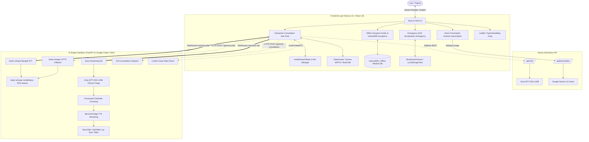

# 🩺 Amar Doctor V1 (আমার ডাক্তার)
> **Resilient AI Telemedicine & Emergency Healthcare Platform for Rural Bangladesh**

Amar Doctor V1 is a full-stack, offline-first digital healthcare system designed specifically for the unique infrastructure and language challenges of rural Bangladesh. It combines **conversational AI triage (Groq GPT-OSS-120B)**, **natural Bengali neural voice synthesis (Microsoft Edge-TTS)**, **GPU-accelerated lip-synced video avatars (MuseTalk / SadTalker)**, **self-hosted Bengali speech recognition (faster-whisper — no browser/cloud Web Speech API is used)**, **computer-vision prescription analysis (Gemini Vision)**, and **zero-bandwidth offline medical decision trees (IndexedDB + PWA)**.

---

## 📑 Table of Contents
1. [Overview & Core Mission](#-overview--core-mission)
2. [Complete System Architecture](#-complete-system-architecture)
   - [High-Level Architecture Diagram](#high-level-architecture-diagram)
   - [Module-by-Module Technical Breakdown](#module-by-module-technical-breakdown)
3. [Feature Breakdown](#-feature-breakdown)
   - [1. AI Doctor Voice & Video Consultation (`/chat`)](#1-ai-doctor-voice--video-consultation-chat)
   - [2. Vision-Based Prescription Scanner (`/prescription`)](#2-vision-based-prescription-scanner-prescription)
   - [3. Offline Medical Knowledge & Symptom Finder (`/symptoms`)](#3-offline-medical-knowledge--symptom-finder-symptoms)
   - [4. Emergency SOS & Fleet Dispatch Dashboard (`/emergency`)](#4-emergency-sos--fleet-dispatch-dashboard-emergency)
   - [5. Interactive Hospital & Health Complex Map (`/map`)](#5-interactive-hospital--health-complex-map-map)
4. [Tech Stack](#-tech-stack)
5. [Directory Structure](#-directory-structure)
6. [Installation & Setup](#-installation--setup)
   - [Frontend (Next.js)](#frontend-nextjs)
   - [Backend AI Sandbox (FastAPI / Colab)](#backend-ai-sandbox-fastapi--colab)
7. [Environment Variables](#-environment-variables)
8. [License & Medical Disclaimer](#-license--medical-disclaimer)

---

## 🌍 Overview & Core Mission

In rural Bangladesh, access to specialized medical advice is constrained by geographical distance, high patient-to-doctor ratios, and variable internet connectivity. Amar Doctor V1 bridges this divide through:

- **Bilingual Accessibility**: Full support for everyday spoken Bengali (বাংলা) and English.
- **Natural Voice First**: Illiterate or elderly patients can speak naturally into their phone or mic and hear empathetic spoken Bengali advice.
- **Graceful Degradation / Dual-Mode**: Operates across high-bandwidth video avatar mode down to low-bandwidth streaming voice, text, or completely offline on-device first-aid protocols.
- **Rapid Emergency Response**: Instant SOS panic button with real-time browser-wide telemetry broadcasting for emergency dispatchers.

---

## 🏛️ Complete System Architecture

### High-Level Architecture Diagram



---

### Module-by-Module Technical Breakdown

```
┌────────────────────────────────────────────────────────────────────────────────────────┐
│                                CLIENT (Browser / PWA)                                  │
├────────────────────────────────────────────────────────────────────────────────────────┤
│ • Speech Input  : MediaRecorder (Opus/WebM) ──► WebSocket /ws/transcribe               │
│ • Speech Output : Queued Web Audio Buffer    ◄── WebSocket /ws/voice-call (Audio Chunks)│
│ • Video Avatar  : Procedural 2D Canvas (60FPS) OR WebRTC / MuseTalk MP4 Stream        │
│ • Emergency Bus : BroadcastChannel + LocalStorage Event Fallback                       │
│ • Offline Cache : ServiceWorker + IndexedDB Medical Conditions                         │
└────────────────────────────────────────────────────────────────────────────────────────┘
                                            │
                    WebSocket & HTTP Tunnel │ (Cloudflare / Ngrok)
                                            ▼
┌────────────────────────────────────────────────────────────────────────────────────────┐
│                        FASTAPI BACKEND AI ENGINE (server.py)                           │
├────────────────────────────────────────────────────────────────────────────────────────┤
│ 1. STT Engine          : faster-whisper (self-hosted only; no browser Web Speech API)  │
│ 2. Clinical Reasoning  : Groq GPT-OSS-120B with rural health system prompt              │
│ 3. TTS Synthesis       : Microsoft Edge-TTS (bn-BD-NabanitaNeural / PradeepNeural)     │
│ 4. Streaming Chunking  : Punctuation triggers (। , . ? !) for instantaneous response   │
│ 5. Avatar Synthesis    : MuseTalk / SadTalker neural lip synchronizer                  │
└────────────────────────────────────────────────────────────────────────────────────────┘
```

---

## 🚀 Feature Breakdown

### 1. AI Doctor Voice & Video Consultation (`/chat`)
- **Speech-to-Text (Bengali & English) — self-hosted only, no browser Web Speech API**:
  - A real Voice-Activity-Detection model (Silero VAD via `@ricky0123/vad-web`, running on-device in WASM) segments the microphone stream into genuine utterances — no fixed-length slicing, and no audio sent anywhere until real speech is detected.
  - Each utterance is sent as a clean WAV over WebSocket `/ws/transcribe` to a local or Colab `faster-whisper` model (HTTP POST `/api/transcribe` as automatic fallback if WebSockets are blocked by proxies).
  - **Turn detection**: driven by the VAD's own speech-end signal, not a client-guessed timer — a turn submits the moment the patient actually stops talking.
  - **Barge-in**: speech detected while the AI is still talking immediately cuts its audio and starts capturing the interruption, like a real phone call.
- **Pipelined Streaming Voice Synthesis (Edge-TTS)**:
  - LLM tokens are buffered until punctuation delimiters (`।`, `.`, `?`, `!`, `,`, `;`) appear.
  - Sub-sentences are immediately converted into natural Bengali audio waveforms using **Microsoft Edge-TTS** (`bn-BD-NabanitaNeural` / `bn-BD-PradeepNeural`).
  - Chunks are piped directly over the WebSocket to [AudioStreamPlayer.js](file:///Users/asif/project%20files/Amar%20Doctor%20V1/lib/audioStreamPlayer.js), playing back gaplessly while the rest of the response is still generating.
- **Dual-Mode Video Avatar (`VideoAvatar.js`)**:
  - **GPU Mode**: Deep-learning driven **MuseTalk** / **SadTalker** that generates lip-synced video frames matching the Bengali audio phonemes.
  - **Offline/Lightweight Canvas Mode**: A 60 FPS HTML5 procedural doctor avatar complete with sinusoidal breathing, periodic eye-blinking, audio-reactive mouth movement, and neon spectral visualizer waves.

---

### 2. Vision-Based Prescription Scanner (`/prescription`)
- **Multimodal Image OCR & Clinical Interpretation**:
  - Supports camera capture and drag-and-drop file upload for both handwritten and printed Bangladeshi prescription slips.
  - Transmits raw image bytes to **Google Gemini 3.6 Flash** with structured vision prompts.
- **Structured Clinical Extraction**:
  - Extracts **Medication Name** (Brand + Generic + Strength, e.g., *Napa Extra — Paracetamol 500mg + Caffeine 65mg*).
  - **Dosage & Timing**: Clear bilingual instructions (e.g., *১টি করে দিনে ৩ বার খাবারের পর* / *1 tablet 3 times daily after meals*).
  - **Clinical Purpose**: Plain-language breakdown of what each medication treats.
  - **Precautions & Side Effects**: Warnings regarding contraindications, alcohol restrictions, and completion of antibiotic courses.
- **Zero-Key Mock Fallback**: Built-in realistic pharmaceutical mock parser for offline demonstrations.

---

### 3. Offline Medical Knowledge & Symptom Finder (`/symptoms`)
- **Zero-Bandwidth Operation**:
  - Entire rural disease dictionary stored in `lib/offlineMedicalDb.js` and synced to the browser's **IndexedDB**.
  - Accessible without any internet connection.
- **Step-by-Step Decision Tree Engine (`symptomFinderEngine.js`)**:
  - Interactive multi-stage triage: Body Area (মাথা, বুক, পেট, হাত-পা, পুরো শরীর) ➔ Primary Symptoms ➔ Duration ➔ Severity Level.
  - Evaluates protocols for life-threatening conditions common in rural zones:
    - 🐍 **Snake Bite (সাপের কামড়)**: Antivenom guidelines, immobilization instructions, strict warnings against tourniquets/incisions.
    - 🦟 **Dengue Fever (ডেঙ্গু জ্বর)**: Fluid management (ORS), platelet tracking, critical warnings against NSAIDs (Aspirin/Ibuprofen).
    - 👶 **Child Pneumonia (শিশুর নিউমোনিয়া)**: Rapid chest in-drawing identification and IMCI guidelines.
    - ⚡ **Heatstroke, Burns, Diarrhea/Cholera, Rabies/Animal bites**.
- **Voice Readout**: Built-in browser speech synthesis button to read first-aid steps aloud to the caregiver.

---

### 4. Emergency SOS & Fleet Dispatch Dashboard (`/emergency`)
- **One-Touch Emergency SOS (`SOSButton.js`)**:
  - Prominently accessible from every page header.
  - Automatically fetches device GPS coordinates (`navigator.geolocation`) with one tap.
- **Real-Time Cross-Tab Broadcaster (`emergencyBroadcaster.js`)**:
  - Employs the browser **BroadcastChannel API** with `localStorage` event fallback.
  - Dispatches emergency signals across all open browser instances and administrative screens in under 5ms.
- **Fleet Dispatch Telemetry**:
  - Status tracking lifecycle: `PENDING` ➔ `DISPATCHED` ➔ `EN_ROUTE` ➔ `RESOLVED`.
  - Realistic rural transport units: *Speedboat Medical Unit #3 (Riverine Char)*, *Upazila Health Response #1*, *Ambulance BD-702*.
  - Interactive **Audio Siren Generator**: Synthesizes a real-time 1.5Hz sawtooth wave warning siren via Web Audio API without needing external MP3 assets.

---

### 5. Interactive Hospital & Health Complex Map (`/map`)
- **Leaflet & OpenStreetMap Integration (`OpenStreetMapView.js`)**:
  - Dynamically renders government Upazila Health Complexes, District Hospitals, and Community Clinics.
  - Real-time geolocation pin pointing user position against medical facilities with distance calculations.
  - Filterable by facility type: *Government Hospitals*, *Community Clinics*, *24/7 Emergency Centers*.
  - Direct one-touch phone dialer links (`tel:+880...`) for rural ambulance dispatch.

---

## 🛠️ Tech Stack

| Domain | Technology | Purpose |
|---|---|---|
| **Frontend Framework** | **Next.js 16 (App Router) + React 19** | Modern server/client architecture |
| **Styling & Design System** | **Tailwind CSS + Custom Modern Tokens** | High-contrast dark medical aesthetics |
| **STT (Speech-to-Text)** | **faster-whisper (self-hosted, GPU-aware)** | On-device Bengali/English transcription — no browser Web Speech API |
| **LLM Clinical Core** | **Groq — GPT-OSS-120B** | Fast open-weight reasoning & symptom triage |
| **Vision (Prescription OCR)** | **Google Gemini 3.6 Vision** | Multimodal prescription image analysis |
| **TTS (Text-to-Speech)** | **Microsoft Edge-TTS (v7 streaming)** | Natural neural Bengali voice at 0 cost |
| **Avatar Lip-Sync** | **MuseTalk / SadTalker** | Neural video frame generation on GPU |
| **Offline Storage** | **IndexedDB + PWA Service Worker** | 100% offline emergency first aid |
| **Realtime Sync** | **WebSockets + BroadcastChannel API** | Live consultation & emergency dispatch |
| **Mapping** | **Leaflet + OpenStreetMap** | Free, open hospital locating |

---

## 📂 Directory Structure

```
Amar Doctor V1/
├── app/
│   ├── api/
│   │   ├── chat/route.js            # Next.js Serverless Groq (GPT-OSS-120B) Chat handler
│   │   └── prescription/route.js    # Gemini Vision prescription OCR handler
│   ├── chat/page.js                 # Live Voice, Video & Text Consultation stage
│   ├── emergency/page.js            # Real-time SOS Dispatcher Dashboard
│   ├── map/page.js                  # Hospital & Upazila Clinic Locator
│   ├── prescription/page.js         # Camera / Drag-and-drop Prescription Scanner
│   ├── symptoms/page.js             # Offline Medical Knowledgebase & Triage
│   ├── globals.css                  # Custom medical dark-mode design system
│   ├── layout.js                    # Global layout, Navbar, SOS button, PWA SW
│   └── page.js                      # Home landing portal & fast feature access
├── backend/
│   ├── amar_doctor_colab.ipynb      # 1-Click Google Colab Notebook (Free T4 GPU)
│   ├── colab_runner.py              # Cloudflare/Ngrok launcher script
│   ├── musetalk_agent.py            # MuseTalk lip-sync pipeline controller
│   ├── server.py                    # FastAPI server (Edge-TTS, Whisper, WS endpoints)
│   ├── requirements.txt             # Python backend dependencies
│   └── static/                      # Static doctor avatar portraits
├── components/
│   ├── Navbar.js                    # Responsive header with live Colab status
│   ├── Footer.js                    # Medical disclaimer & regional helpline links
│   ├── SOSButton.js                 # Global floating emergency panic button
│   ├── VideoAvatar.js               # Canvas 60FPS / MuseTalk dynamic video player
│   └── OpenStreetMapView.js         # Interactive Leaflet map component
├── lib/
│   ├── audioStreamPlayer.js         # Gapless audio queue player for TTS chunks
│   ├── emergencyBroadcaster.js      # Multi-tab BroadcastChannel SOS state bus
│   ├── offlineMedicalDb.js          # IndexedDB schema & rural disease protocols
│   └── symptomFinderEngine.js       # Offline medical decision tree engine
├── public/                          # Static assets, icons, manifest.json
└── README.md                        # Documentation & architecture specifications
```

---

## 💻 Installation & Setup

### Frontend (Next.js)

1. **Clone the repository**:
   ```bash
   git clone https://github.com/your-repo/amar-doctor-v1.git
   cd "Amar Doctor V1"
   ```

2. **Install Node dependencies**:
   ```bash
   npm install
   ```

3. **Configure Environment Variables**:
   Create a `.env.local` file in the root directory:
   ```env
   GROQ_API_KEY=your_groq_api_key_here
   GEMINI_API_KEY=your_google_gemini_api_key_here
   ```
   `GROQ_API_KEY` powers clinical chat triage (GPT-OSS-120B); `GEMINI_API_KEY` is only used for prescription image OCR (Gemini Vision — GPT-OSS-120B is text-only).

4. **Run development server**:
   ```bash
   npm run dev
   ```
   Open [http://localhost:3000](http://localhost:3000) in your browser.

---

### Backend AI Sandbox (FastAPI / Colab)

The backend provides **Whisper STT**, **Edge-TTS Bengali voice**, and **MuseTalk video generation**.

#### Option A: Run on Google Colab (Recommended — Free T4 GPU)
1. Open [Google Colab](https://colab.research.google.com/).
2. Click **Upload** and upload `backend/amar_doctor_colab.ipynb`.
3. In Colab menu: **Runtime > Change runtime type > Select T4 GPU**.
4. Run all cells (`Ctrl + F9` or `Cmd + F9`).
5. Copy the generated Cloudflare URL (e.g., `https://xxxx.trycloudflare.com`).
6. In the Amar Doctor web interface, click **Colab Settings** in the navbar or `/chat` page and paste your URL!

#### Option B: Run Locally (Python 3.10+)
```bash
# 1. Create and activate a virtual environment
python3 -m venv .venv
source .venv/bin/activate  # On Windows: .venv\Scripts\activate

# 2. Install backend requirements
pip install -r backend/requirements.txt

# 3. Start the FastAPI server
python -m uvicorn backend.server:app --reload --port 8000
```
API documentation will be accessible at [http://localhost:8000/docs](http://localhost:8000/docs).

---

## ⚙️ Environment Variables

| Variable | Scope | Description |
|---|---|---|
| `GROQ_API_KEY` | Next.js (`.env.local`) & Colab | Groq API key for clinical chat triage (GPT-OSS-120B). |
| `GEMINI_API_KEY` | Next.js (`.env.local`) | Google Gemini API key for prescription image analysis (Vision OCR only — GPT-OSS-120B has no vision support). |
| `LIVEKIT_URL` | Colab / Backend (Optional) | LiveKit WebRTC server URL for cloud video streaming. |
| `LIVEKIT_API_KEY` | Colab / Backend (Optional) | LiveKit cloud API authentication key. |
| `LIVEKIT_API_SECRET` | Colab / Backend (Optional) | LiveKit cloud API secret. |

---

## 📜 Medical Disclaimer

> **⚠️ IMPORTANT NOTICE**:  
> Amar Doctor V1 (আমার ডাক্তার) is an artificial intelligence-assisted consultation and triage aid designed to provide preliminary healthcare guidance and emergency first-aid information in resource-constrained environments.  
> **It does NOT replace professional diagnosis, treatment, or judgment by a licensed medical practitioner.**  
> In cases of severe trauma, chest pain, stroke symptoms, uncontrolled bleeding, snakebite, or acute respiratory distress, users must immediately contact local emergency services or visit the nearest Upazila Health Complex / District Hospital.
